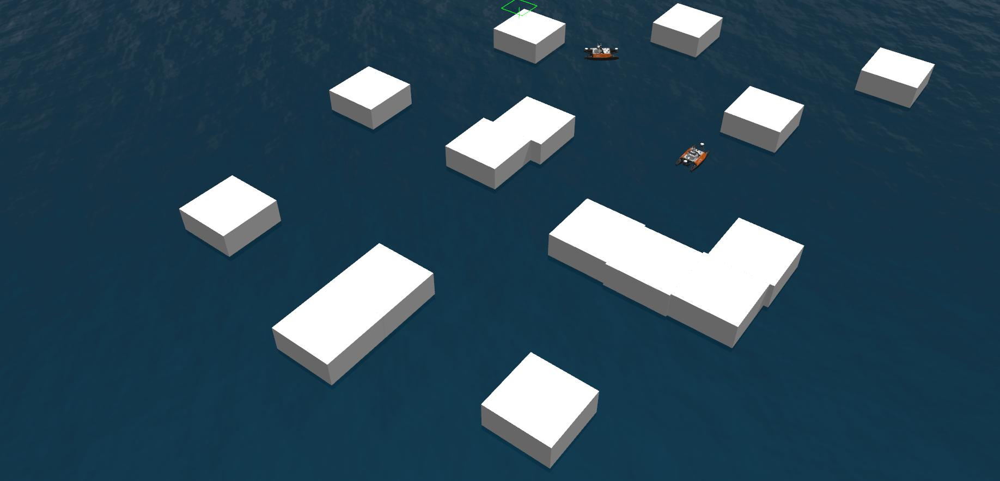
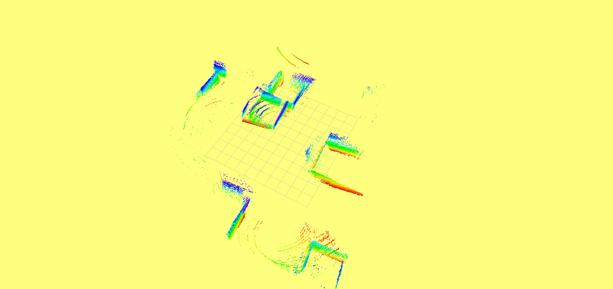

# USV_real-time_map



**Description**

Build ESDF map in USV simulator in real-time. ESDF method forked [FIESTA](https://github.com/HKUST-Aerial-Robotics/FIESTA), simulator forked from [otter_simulator](https://github.com/jhlenes/usv_simulator) and TaoHuang@HiZJU. Link of Otter USV [here](https://www.maritimerobotics.com/otter), 

Topic 1: `/USV_0/lidar_3d/points`, PointCloud2

Topic 2: `/USV_0/pcl_node/Transform_esdf`, TF2 pose

Topic 3: `/USV_0/top_camera/image_raw`, image

### Build Simulator

```bash
sudo apt install ros-noetic-desktop-full

# Install dependencies
sudo apt install ros-noetic-velodyne-gazebo-plugins ros-noetic-teleop-twist-keyboard ros-noetic-xacro ros-noetic-pcl-conversions ros-noetic-robot-localization

# Init catkin_ws and make
cd simulator/src
catkin_init_workspace

# Make
cd simulator
catkin_make # add SpeedCourse.h into ./devel/include/usv_msgs

source devel/setup.zsh
```

### Build FIESTA

```bash
cd fiesta
catkin_make
source devel/setup.zsh

# cow_and_lady demo from rosbag
roslaunch fiesta cow_and_lady.launch
rosbag play data.bag # demo rosbag~=4.5G, http://robotics.ethz.ch/~asl-datasets/iros_2017_voxblox/data.bag
```

### Running shells

```bash
# 1. Simulator
roslaunch usv_launch swarm_scenario.launch
# Add 2 topics to publish: pcl/node, image. Image in KITTI format size.

# 2. Keyboard
roslaunch usv_launch keydrive.launch

# 3. ESDF building
roslaunch fiesta usv_simulator.launch # subsecribe the previous two topics
```



